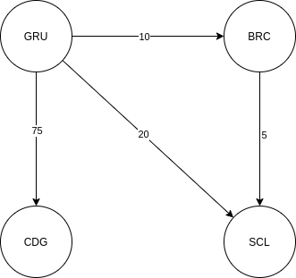

# bexs-backend-exam

O objetivo desta aplicação é implementar um sistema capaz de calcular rotas entre dois pontos que tenham o menor custo, sendo sua interface exposta via REST API como via Console.

## Stack
- Go
- Docker


## Estrutura de pastas

    .
    ├── dist                   # Arquivos compilados
    ├── domain                 # Contém as entidades da aplicação
    │   ├── exceptions
    |   └── model
    ├── infrastructure 
    |   ├── presenter          # Implementação dos métodos de apresentação
    |   ├── repository         # Implementação da base de dados
    |   └── service            # Implementação das interfaces REST e Console.
    ├── interface              # Contém as interfaces utilizadas pela aplicação
    |   ├── interactor   
    |   ├── presenter 
    |   └── repository  
    ├── internal               # Contém estruturas e funções utilizadas internamente por demais pacotes 
    ├── usecase                # Implementação dos casos de uso
    ├── utils                  # Funções utilitárias
    └── README.md

## Endpoints
Após iniciar a aplicação, a API estará disponível na porta 8080(default), disponibilizando os seguintes endpoints

| Name | Path | Method | Content-Type | Description |
| ------ | ------ | ------ | ------ | ------ |
| Buscar caminho mais barato| /v1/path?origin={value}&destination={value}| GET | application/json | Retorna o preço total e os aeroportos presentes na rota entre a origem e destino. |
| Adicionar nova rota | /v1/route | POST| application/json | Adiciona uma nova rota à base de dados. |

## Request & Response Examples

### API Resources
- [GET /v1/path](#get-v1path)
- [POST /v1/route](#get-v1route)

### GET /v1/path
Example: /v1/path?origin=GRU&destination=CDG

Response body:

    {
        "connections":["GRU","BRC","SCL","ORL","CDG"],
        "price":40
    }

### POST /v1/route

Request body:

    {
        "origin":"GRU",
        "destination":"BRC",
        "price":10
    }


## Setup

Primeiramente, você deve ter o docker instalado. As instruções podem ser encontradas [aqui](https://docs.docker.com/install/)

## Build

Para rodar a aplicação realize o build através de:

```sh
make build
```
Com isto, um executável sera gerado na pasta dist, podendo ele ser executado com o arquivo de rotas iniciais como argumento.

```sh
./dist/service input-routes.csv
```

Opcionalmente você pode ativar o recurso de cache setando o environment USE_CACHE para diferente de false, também é possível alterar a porta da API Rest com o environment PORT:

```sh
export USE_CACHE=true  (default: false)
export PORT=8080       (default: 8080)
```

Obs: Se o arquivo de entrada não existir, ele será criado em branco.

### Testes

Para realizar os testes, execute:

```sh
make test
```

Também é possível executar os testes através de:
```sh
go test ./...
```

## Design

A aplicação foi desenvolvida seguindo os padrões da Clean Architecture, desta forma desacoplando os componentes do sistema, possibilitando eles serem testados individualmente e que alterações em camadas externas não impactem camadas internas.

Para implementação da solução foi escolhido o uso da estrutura de grafos, devido a já existência de algoritmos conhecidos e consolidados que permitam realizar a busca de caminhos entre dois pontos. Para a estrutura de grafos ainda, foi utilizado um conjunto entre um Slice de vértices e um mapa de referências, essa abordagem foi escolhida pois a função de hasheamento acaba tendo um custo maior do que acessar diretamente pelo índice do array, sendo a segunda a operação mais comum na aplicação.

``` go
type Graph struct {
	Vertexes        []GraphVertex
	VertexReference map[VertexID]int
}
```

A estrutura é composta por vértices e arestas, estando as conexões(arestas) em cada um dos vértices, indicando os movimentos possíveis a partir de determinado ponto.

<p align="center">
  
</p>

O algoritmo selecionado, para a busca do caminho mais barato entre dois pontos, foi o Djikstra com complexidade de tempo  	O(EV + V²log V), sendo E o número de arestas e V o número de vértices. Djikstra é o algoritmo com menor complexidade de tempo em grafos direcionados que não possuam ciclos negativos. Mesmo Djikstra sendo o algoritmo mais rápido para essa situação, ele ainda possui alto custo computacional para grafos muito grandes, devido a isso foi implementado um cache em memória que armazena caminhos já buscados anteriormente, evitando o recálculo dos mesmos.